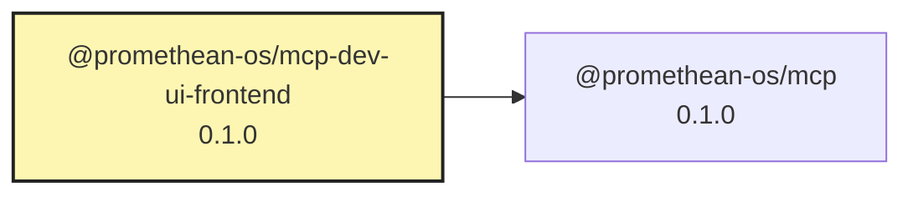

# @promethean-os/mcp-dev-ui-frontend

Frontend components for MCP Dev UI built with ClojureScript.

## Installation

```bash
pnpm add @promethean-os/mcp-dev-ui-frontend
```

## Development

```bash
# Start development server
pnpm dev

# Build for production
pnpm build

# Clean build artifacts
pnpm clean
```

## Usage

This package contains the ClojureScript frontend components for the MCP Development UI.

## License

MIT

<!-- READMEFLOW:BEGIN -->
# @promethean-os/mcp-dev-ui-frontend

Frontend components for MCP Dev UI

[TOC]


## Install

```bash
pnpm -w add -D @promethean-os/mcp-dev-ui-frontend
```

## Quickstart

```ts
// usage example
```

## Commands

- `build`
- `dev`
- `clean`
- `test`
- `typecheck`
- `lint`
- `serve`

## License

GPL-3.0-only


### Package graph




<!-- READMEFLOW:END -->
